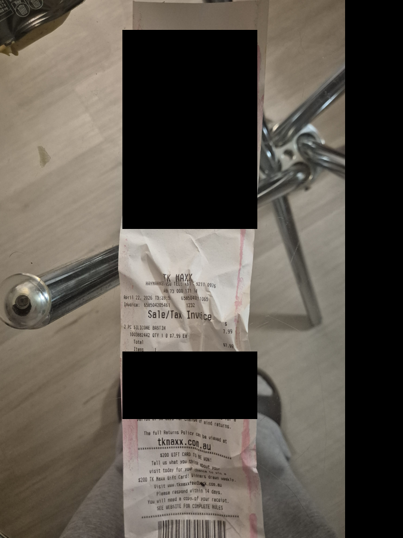
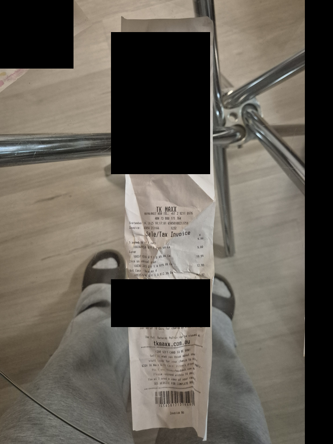
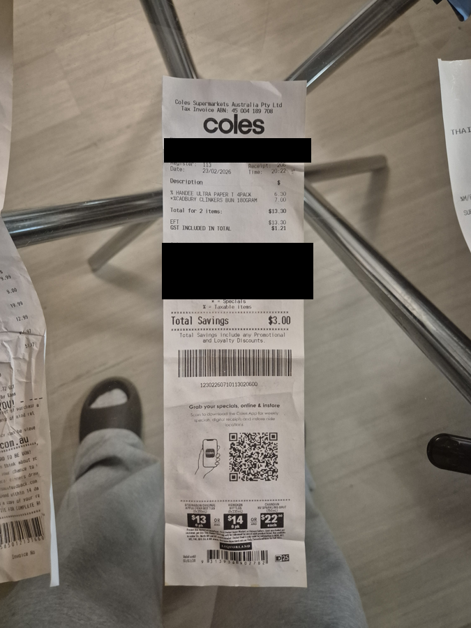
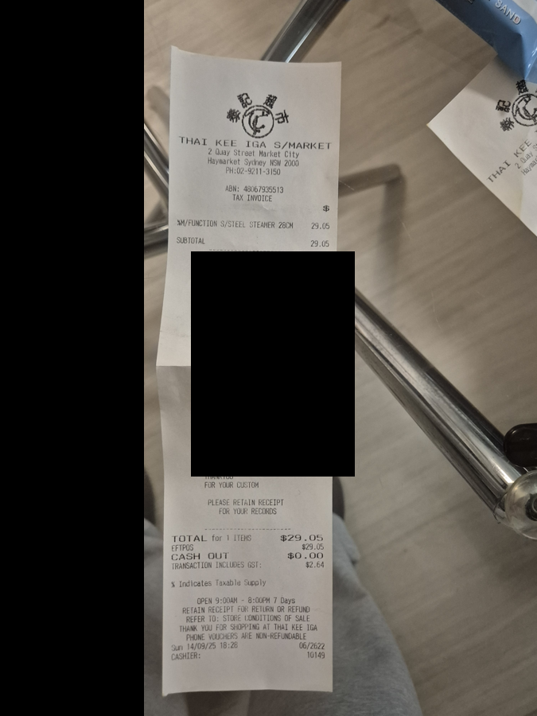
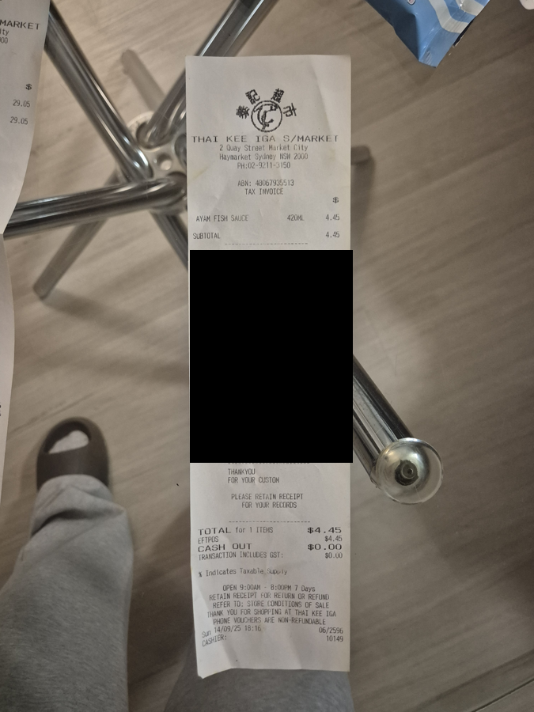
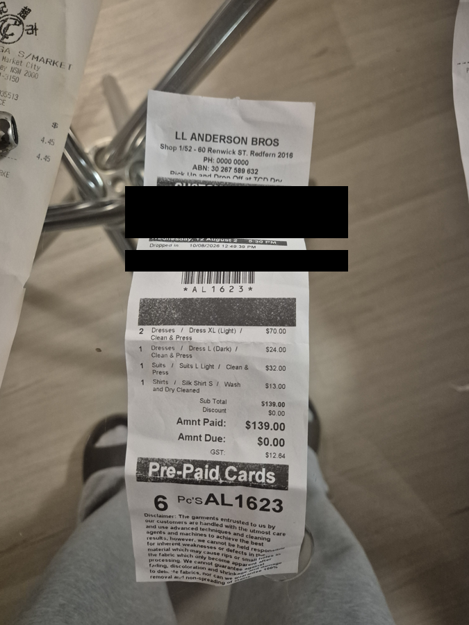

# Real receipts, and what came back

Six genuine receipts photographed on a phone — crumpled, shot sideways, one
food-stained, one legitimately GST-free. Each image below is paired with the
JSON the pipeline actually produced from it.

**All six were correct on every total, tax and date**, checked by reading the
originals by eye. Nothing incorrect was returned without being flagged.

The black bars cover card numbers, staff names, a phone number and other
people's receipts caught in frame. Nothing behind them was used by the
extraction — the values below come from the printed vendor, item and total
lines, which are all still visible.

---

## 1 · TK Maxx — $7.99



```json
{ "vendor": "TK Maxx", "date": "2026-04-22", "currency": "AUD",
  "subtotal": 7.26, "tax": 0.73, "total": 7.99,
  "tax_included_in_total": true, "category": "supplies", "status": "ok" }
```

Sideways, heavily creased, highlighter across it, food stains. The GST line
reads `Inclusive of $0.73 GST`, so the subtotal is **derived**: 7.99 − 0.73.

---

## 2 · TK Maxx — $51.97



```json
{ "vendor": "TK Maxx", "date": "2025-09-14", "currency": "AUD",
  "subtotal": 47.25, "tax": 4.72, "total": 51.97,
  "tax_included_in_total": true, "category": "supplies",
  "unreadable_fields": ["tax"], "status": "check" }
```

Folded across the middle. It flagged `tax` as guessed because the GST line sits
on the crease — **and still read it correctly**. Honest uncertainty rather than
silent confidence is the behaviour that makes the review step cheap.

---

## 3 · Coles — $13.30



```json
{ "vendor": "Coles", "date": "2026-02-23", "currency": "AUD",
  "subtotal": 12.09, "tax": 1.21, "total": 13.30,
  "tax_included_in_total": true, "category": "supplies", "status": "ok" }
```

Long supermarket docket where the total sits well away from the items, with
promotional panels and a QR code below it.

---

## 4 · Thai Kee IGA — $29.05



```json
{ "vendor": "Thai Kee IGA S/Market", "date": "2025-09-14", "currency": "AUD",
  "subtotal": 26.41, "tax": 2.64, "total": 29.05,
  "tax_included_in_total": true, "category": "supplies", "status": "ok" }
```

The printed `SUBTOTAL` line says `29.05` — the tax-inclusive figure. The
ex-GST subtotal of `26.41` had to be derived from `TRANSACTION INCLUDES GST:
$2.64`, not copied off the label.

---

## 5 · Thai Kee IGA — $4.45, no GST



```json
{ "vendor": "Thai Kee IGA S/Market", "date": "2025-09-14", "currency": "AUD",
  "subtotal": 4.45, "tax": 0.00, "total": 4.45,
  "tax_included_in_total": true, "category": "supplies", "status": "check" }
```

`tax: 0.00` is **correct**. The receipt prints `TRANSACTION INCLUDES GST: $0.00`
— the item is fish sauce, and basic food is GST-free in Australia. Note the
`% Indicates Taxable Supply` legend with no marker against the line item.

Flagged as `check` anyway, because zero GST on an Australian receipt is unusual
enough to be worth three seconds of a human's attention. That's the validator
being appropriately suspicious, not wrong.

---

## 6 · Dry cleaner — $139.00



```json
{ "vendor": "LL Anderson Bros", "date": "2026-08-10", "currency": "AUD",
  "subtotal": 126.36, "tax": 12.64, "total": 139.00,
  "tax_included_in_total": true, "category": "professional_services",
  "unreadable_fields": ["payment_method"], "status": "check" }
```

The hardest of the six. `Sub Total`, `Amnt Paid` and `GST` are printed in three
different places, and the docket never states how it was paid — so
`payment_method` was flagged rather than invented. `139 ÷ 11 = 12.636`, so the
GST is internally consistent to the cent.

---

## What this set is and isn't

Six receipts is a working prototype, not a proven production system. It has not
been run at volume, across many clients, or on receipts in other currencies or
languages. What it does show is that the failure mode is *flagging*, not silent
error — which is the property the whole design depends on.
